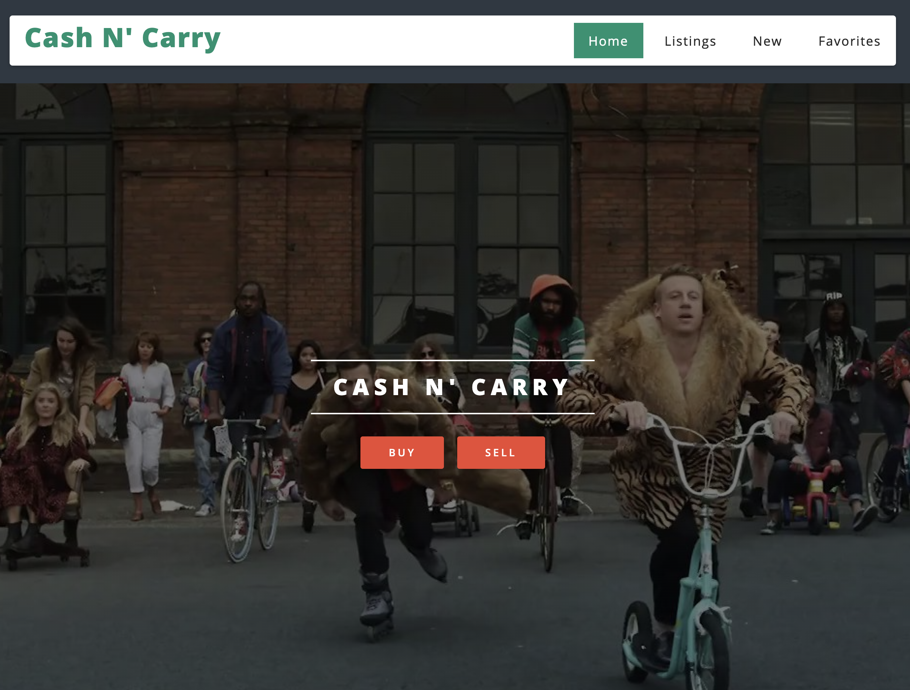
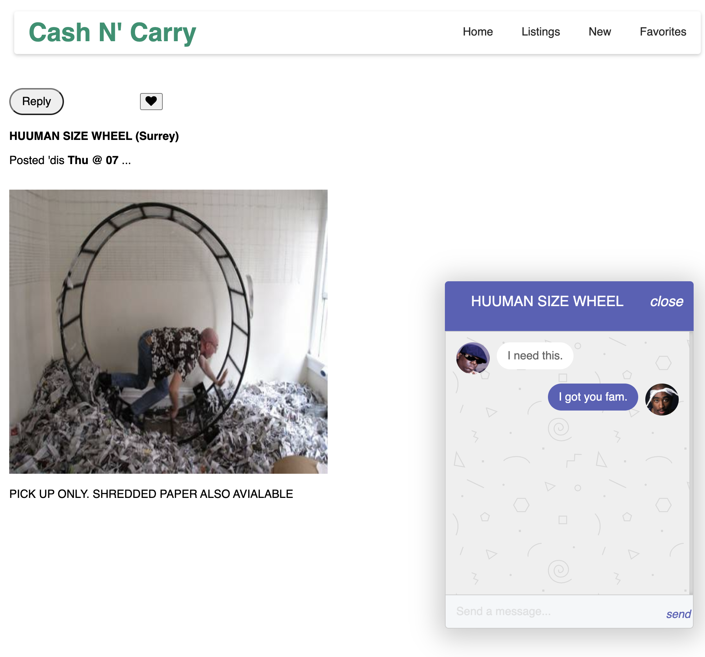

# Cash n' Carry

An app where you can put different types of things up for sale and let buyers find the items they are looking for quickly, and easily contact sellers.

## Screenshots

## Main Features
- users can see featured items on a main feed
- users can filter items by price,
- users can favourite items to check up on them later
= users can send messages to the user that is listing the item

Admins can:
- post items, which can be seen by others
- remove items from the site
- mark items as SOLD!,
- send a message via web-socket back on negotiations in buying the said item

## Getting Started
1. Create the `.env` by using `.env.example` as a reference: `cp .env.example .env`
2. Set the `DATABASE_URL` to your postgres database on elephant sql.
3. Install dependencies: `npm i`
5. Run the server: `npm run local`
6. Visit `http://localhost:8080/api/users/1` to login in as a user
7. Post your first ad!

## Dependencies

- ejs
- PG 6.x
- dotenv
- express
- pg native
- body-parser
- cookie-session
- NPM 5.x or above
- Node 10.x or above
- socket-io 2.x or above
- node-sass-middleware
